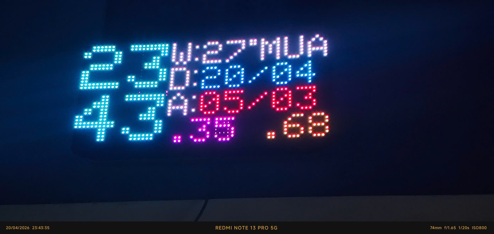
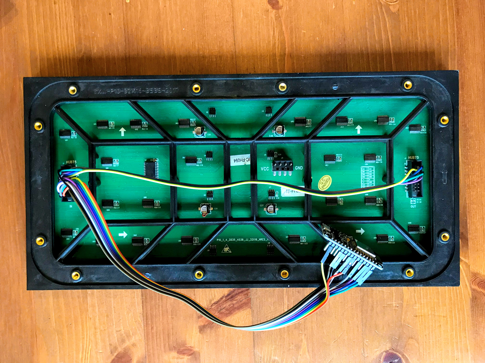
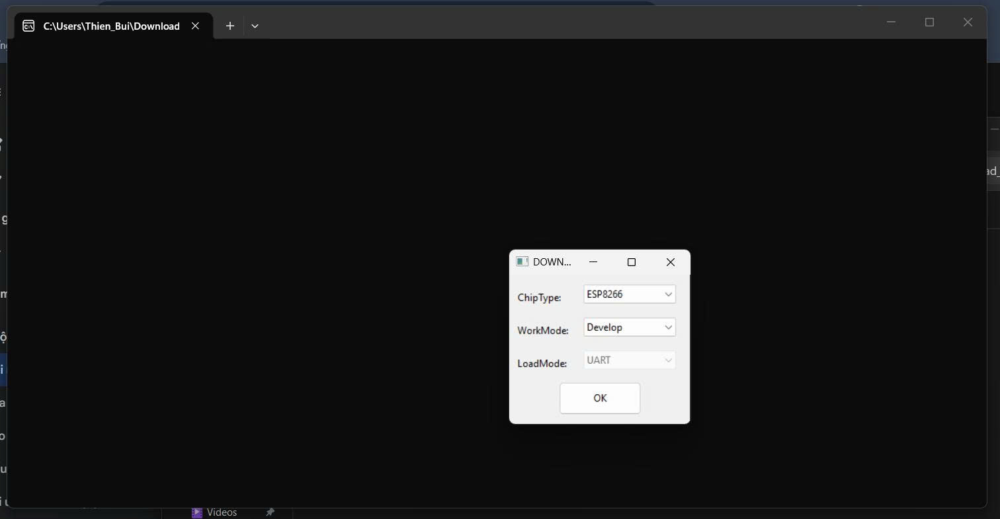
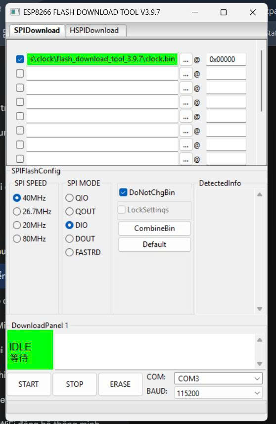
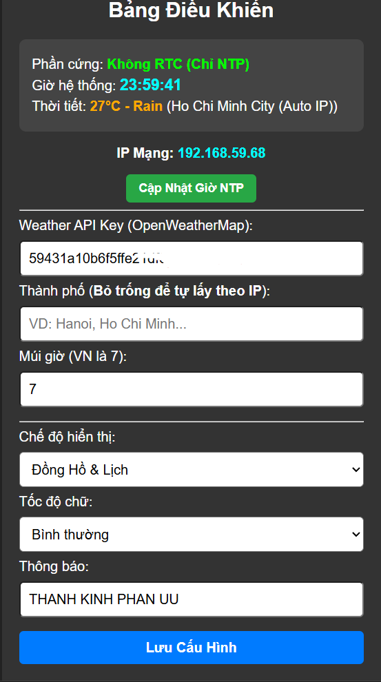

# 🕒 ESP8266 Smart LED Matrix Clock (Đồng hồ Ma trận Thông minh)

Dự án Đồng hồ LED Ma trận sử dụng vi điều khiển ESP8266 (NodeMCU/Wemos) kết hợp với tấm nền LED HUB75 (P10, P5, P3...). Đồng hồ tích hợp đa chức năng: xem ngày tháng Âm dương, theo dõi thời tiết, tự động đồng bộ giờ qua Internet và có Web UI quản lý cực kỳ tiện lợi.

## ✨ Tính năng nổi bật

* **🕰️ Hiển thị thời gian thực:** Giờ, Phút, Giây (dấu `:` nhấp nháy siêu mỏng, tiết kiệm diện tích).
* **📅 Lịch Âm Dương:** Tự động tính toán và hiển thị Dương lịch (Xanh dương) và Âm lịch (Đỏ). Hỗ trợ hiển thị tháng nhuận.
* **⛅ Thời tiết thông minh:** * Tự động định vị Thành phố theo IP mạng hoặc nhập thủ công.
    * Hiển thị nhiệt độ và trạng thái thời tiết (NẮNG, MƯA, MÂY, SÉT).
    * **Nhiệt độ tự đổi màu:** Lạnh (<20°C: Xanh biển), Mát (20-30°C: Trắng), Nóng (>30°C: Đỏ cam).
* **🧠 Tự động nhận diện phần cứng (Auto-Fallback):**
    * Quét và ưu tiên sử dụng mạch RTC DS3231 nếu được kết nối (giữ giờ chuẩn kể cả khi mất điện/mất mạng).
    * Tự động chuyển sang chế độ thuần NTP (chạy bằng bộ đếm ảo của ESP) nếu không có mạch RTC.
* **🌐 Web UI Control Panel:** Trang quản trị thân thiện truy cập qua trình duyệt. Cho phép cài đặt WiFi, nhập API Key thời tiết, chỉnh múi giờ, tốc độ chữ và thiết lập thông báo chạy ngang màn hình.

---

## 🛠️ Yêu cầu Phần cứng

1.  Vi điều khiển: **ESP8266** (NodeMCU D1 Mini hoặc tương đương).
2.  Màn hình: **Tấm LED Matrix HUB75** (Kích thước 64x32).
3.  Nguồn cấp: **Nguồn 5V - 5A** (Trở lên) để cấp đủ dòng cho LED Matrix.
4.  Dây cắm Jumper, cáp IDC 16 pin.
5.  *(Tùy chọn)* Module RTC DS3231 để giữ giờ offline.

*(Sơ đồ cắm cáp tín hiệu HUB75 vào mạch ESP8266)*

---

## 🔌 Sơ đồ chân (Pinout)

**1. Kết nối Màn hình LED P5 (Cổng PI) với ESP8266:**

Sử dụng thư viện PxMatrix, kết nối theo bảng sau:

| Cổng PI trên P5 | Chân cắm trên ESP8266 | Chức năng tín hiệu |
| :--- | :--- | :--- |
| **A** | `D1` | Quét hàng (Row A) |
| **B** | `D2` | Quét hàng (Row B) |
| **C** | `D8` | Quét hàng (Row C) |
| **D** | `D6` | Quét hàng (Row D) |
| **LAT** | `D0` | Chốt dữ liệu (Latch) |
| **OE** | `D4` | Bật/tắt LED (Output Enable) |
| **CLK** | `D5` | Xung nhịp đồng bộ |
| **R1 (hoặc R0)**| `D7` | Truyền tín hiệu 6 màu |
| **GND** | `GND` | Nối chung Mass (Chống chớp) |

> **Lưu ý quan trọng về nguồn:** Mạch bắt buộc phải được nối chung mass (GND) giữa ESP8266, tấm LED và nguồn cấp để đảm bảo tín hiệu ổn định, giải quyết triệt để tình trạng chớp nháy hoặc nhiễu màn hình.

**2. Kết nối Mạch thời gian thực DS3231 với ESP8266:**

| Chân trên DS3231 | Chân cắm trên ESP8266 | Chú thích |
| :--- | :--- | :--- |
| **SDA** | `D3` | Giao tiếp I2C |
| **SCL** | `TX` | Giao tiếp I2C |
| **VCC** | `3V3` | **Tuyệt đối không cấp 5V** |
| **GND** | `GND` | Nối chung Mass |

**3. Sơ đồ nối vòng (Loop-back) tín hiệu màu trên tấm P5:**

Thực hiện nối dây chéo từ cổng PI (Đầu vào) sang cổng PO (Đầu ra) trực tiếp trên mặt lưng của tấm LED ma trận theo thứ tự sau:

| Cổng PI (Đầu vào) | Kết nối | Cổng PO (Đầu ra) |
| :--- | :---: | :--- |
| **R2** | ↔ | **R1 (hoặc R0)** |
| **G1** | ↔ | **R2** |
| **G2** | ↔ | **G1** |
| **B1** | ↔ | **G2** |
| **B2** | ↔ | **B1** |

---

## 🚀 Hướng dẫn Nạp Firmware (Dành cho người không muốn cài đặt IDE)

Nếu bạn không muốn biên dịch code từ mã nguồn, bạn có thể nạp trực tiếp file `clock.bin` vào ESP8266 thông qua công cụ của nhà sản xuất.

**Bước 1:** Tải phần mềm [ESP8266 Flash Download Tool V3.9.7](https://www.espressif.com/en/support/download/other-tools).  
**Bước 2:** Mở phần mềm, chọn cấu hình: `ChipType: ESP8266` / `WorkMode: Develop` / `LoadMode: UART`.

**Bước 3:** Cấu hình thông số nạp theo đúng hình ảnh bên dưới:
* Chọn đường dẫn tới file `clock.bin` (Nhớ tích vào ô vuông bên trái).
* Địa chỉ nạp: `0x00000`
* SPI SPEED: `40MHz`
* SPI MODE: `DIO` *(Rất quan trọng, nếu để QIO mạch có thể không khởi động được).*
* FLASH SIZE: `32Mbit` (hoặc tương ứng với mạch của bạn).
* Chọn đúng cổng COM đang cắm mạch.

**Bước 4:** Nhấn **START** và đợi đến khi ô panel hiện màu xanh lá chữ **FINISH**.

---

## ⚙️ Hướng dẫn Sử dụng & Cấu hình

1.  **Cấp nguồn:** Sau khi nạp code và nối dây, cấp nguồn 5V cho mạch và bảng LED.
2.  **Kết nối WiFi Setup:** Mạch sẽ phát ra một WiFi có tên `DongHo_Yosef_AP` (Mật khẩu: để trống). Dùng điện thoại/máy tính kết nối vào WiFi này. (**Nhấn Exit** nếu muốn dùng ở chế độ offline phụ thuộc vào RTC. **Kết nối wifi** tạm rồi sau đó tắt wifi độ chính xác phụ thuộc vào RTC)
3.  **Vào trang quản trị:** Mở trình duyệt và truy cập vào địa chỉ IP: `192.168.4.1`. Màn hình chọn mạng WiFi sẽ hiện ra, bạn nhập WiFi nhà bạn vào để đồng hồ kết nối mạng.
4.  **Bảng Điều Khiển (Control Panel):**
    * Sau khi đồng hồ đã có mạng (trên màn hình LED sẽ hiện IP, ví dụ `192.168.1.x`), hãy dùng điện thoại đang bắt cùng mạng WiFi nhà truy cập vào địa chỉ IP đó.
    * Tại đây, bạn có thể:
        * Nhập **API Key** của OpenWeatherMap để hiển thị thời tiết. *(Đăng ký tài khoản miễn phí tại [openweathermap.org](https://openweathermap.org/) để lấy key).*
        * Thay đổi thông báo chạy chữ.
        * Cập nhật giờ thủ công hoặc chỉnh giờ Offline.

---

## 📸 Giao diện Bảng Điều Khiển (Web UI)

Giao diện quản lý trên trình duyệt được thiết kế trực quan, tối màu (Dark mode) giúp dễ nhìn và thao tác trực tiếp từ điện thoại hoặc máy tính:

**Các chức năng chính trên Web UI:**
* **Thông tin hệ thống:** Xem nhanh trạng thái phần cứng (Có dùng mạch RTC hay đang chạy thuần NTP), Giờ hệ thống hiện tại, thời tiết và IP mạng.
* **Cập Nhật Giờ NTP:** Nút bấm ép đồng hồ đồng bộ lại thời gian ngay lập tức qua máy chủ Internet.
* **Weather API Key:** Nơi nhập mã API từ OpenWeatherMap.
* **Thành phố (Tự động IP):** Bỏ trống để hệ thống tự dò vị trí qua IP, hoặc nhập tên thành phố thủ công (VD: `Ho Chi Minh`, `Hanoi`).
* **Múi giờ:** Cài đặt múi giờ địa phương (Mặc định Việt Nam là `7`).
* **Chế độ hiển thị & Tốc độ:** Tùy chọn kiểu hiển thị màn hình (Đồng hồ & Lịch...) và tốc độ cuộn chữ.
* **Thông báo (Chạy chữ):** Nhập nội dung bất kỳ để dòng chữ chạy ngang dưới đáy màn hình LED.
* **Lưu Cấu Hình:** Áp dụng ngay lập tức các thay đổi mà không cần khởi động lại mạch.

---

## 💻 Hướng dẫn Biên dịch từ Mã nguồn (Build from Source)

Dành cho các bạn muốn tùy biến lại code, thay đổi font chữ hoặc tự thêm tính năng mới:

1. Cài đặt **Arduino IDE** (Khuyên dùng bản 1.8.x hoặc 2.x mới nhất).
2. Thêm gói hỗ trợ board ESP8266 vào Arduino IDE:
   * Vào `File` > `Preferences`.
   * Thêm đường dẫn sau vào ô **Additional Boards Manager URLs**: 
     `http://arduino.esp8266.com/stable/package_esp8266com_index.json`
   * Vào `Tools` > `Board` > `Boards Manager`, tìm `esp8266` và cài đặt.
3. Cài đặt đầy đủ các thư viện đã liệt kê ở mục **Thư viện sử dụng** thông qua `Library Manager` trong Arduino IDE.
4. Mở file `.ino` của dự án, chọn board **NodeMCU 1.0 (ESP-12E Module)**.
5. Biên dịch và nạp code (Upload).

---

## ❓ Các lỗi thường gặp (Troubleshooting)

* **Màn hình LED bị chớp giật, nhiễu loạn hoặc tối mờ:** * Nguyên nhân 90% là do thiếu dòng. Hãy đảm bảo nguồn 5V của bạn có dòng ra thực tế ít nhất từ 3A đến 5A. Cáp USB cắm từ máy tính không đủ dòng để kéo tấm LED Matrix.
* **Không bắt được WiFi phát ra từ ESP8266 lúc mới cài đặt:**
  * Nhấn nút `RST` trên mạch ESP8266 để khởi động lại. Đảm bảo bạn cấp nguồn ổn định.
* **Đồng hồ hiển thị thời tiết sai hoặc báo lỗi:**
  * Kiểm tra lại mã API Key của OpenWeatherMap trên Web UI xem có bị dư khoảng trắng hay không. 
  * API Key mới tạo có thể mất vài giờ để được kích hoạt trên hệ thống.
* **Đồng hồ chạy sai giờ khi cúp điện (Nếu có dùng RTC):**
  * Kiểm tra lại pin cúc áo (CR2032) trên module DS3231.
  * Đảm bảo đã hàn/cắm đúng chân SDA và SCL.

---

## 📚 Thư viện sử dụng

Dự án được xây dựng dựa trên các thư viện mã nguồn mở tuyệt vời sau:
* [PxMatrix](https://github.com/2dom/PxMatrix) - Thư viện điều khiển LED Matrix HUB75.
* [WiFiManager](https://github.com/tzapu/WiFiManager) - Quản lý cấu hình WiFi.
* [ArduinoJson](https://arduinojson.org/) - Xử lý dữ liệu thời tiết API.
* [RTClib](https://github.com/adafruit/RTClib) - Giao tiếp module thời gian thực.
* *[Lunar.h](http://lunar.tbgroup.run.place/)* - Thư viện chuyển đổi lịch Âm Dương tự phát triển/tùy biến.

---
*Được phát triển với niềm đam mê chế tạo & điện tử (DIY). Chúc các bạn làm thành công!* 🚀

## [🖊️ĐÁNH GIÁ](https://dapln.rf.gd/)

## 🤝 Đóng góp (Contributing)
Mọi đóng góp để tối ưu hóa mã nguồn, thêm hiệu ứng chuyển động hoặc ngôn ngữ mới đều được chào đón! Hãy tạo Pull Request hoặc mở Issue nếu bạn phát hiện lỗi.

## 📄 Giấy phép (License)
Dự án được phân phối dưới giấy phép MIT. Bạn có thể tự do sử dụng, chỉnh sửa và phân phối lại cho cả mục đích cá nhân và thương mại. Chi tiết xem tại file `LICENSE`.
